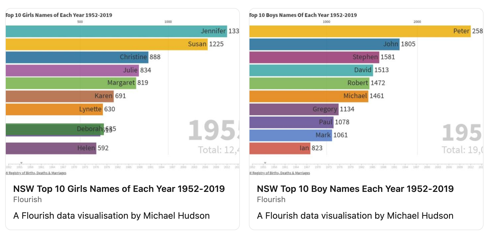

```{r setup, include=FALSE}
knitr::opts_chunk$set(echo = FALSE)
```



A project I undertook to practice my data wrangling skills.
[NSW BDM](https://www.nsw.gov.au/family-and-relationships/births/popular-baby-names) 
provides the raw data in pdf format, so the biggest challenge was extracting 
that data into something I could work with.

I have the data for 2020. Just need some spare time to update the project.

You can see the racing bar charts here:

[Boys names](https://public.flourish.studio/visualisation/4659238/){target="_blank"}

[Girls names](https://public.flourish.studio/visualisation/4692834/)


