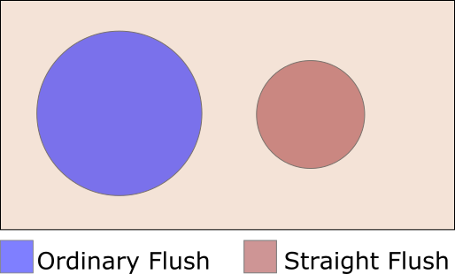

```{r setup, include=FALSE}
knitr::opts_chunk$set(echo = FALSE)
```

```{r poker-hands, fig.cap= "Source: https://www.poker.org/wp-content/uploads/2020/12/Poker_Info_Best_Poker_Hands_1-scaled.jpg"}
knitr::include_graphics("Poker_Hands_1200x754.jpg")
```


### Relevance to Data Analytics Skills
* Using RMarkdown
* Using LaTeX in RMarkdown
* Using HTML in RMarkdown
* Using R code
* Ability to explain statistical concepts
* Ability to explain other people's code
* Ability to find resources online

---
### To the project...
An interesting exercise is to use R to explain and analyse the probabilities of different hands in draw poker. In this exercise, a hand of poker consists of five cards drawn randomly without replacement from a single, well-shuffled deck of 52 cards. The total number of possible five card hands, drawn from a 52 card deck without replacement and given that order does not matter, is:<br>

\begin{align*}
Total\ number\ of\ possible\ poker\ hands = {_{52}C_5} & = \frac{52!}{5! \times 47!} \\
\\
& = \frac{52 \times 51 \times 50 \times 49 \times 48}{5 \times 4 \times 3 \times 2 \times 1} \\
\\
& = 2,598,960
\end{align*}

<br>

The poker hands of interest are shown in the image at the top of this post and are described as:<br>

<table style="width: 100%">
    <colgroup>
        <col style="width: 7%;">
        <col style="width: 17%;">
        <col style="width: 76%;">
    </colgroup>
    <thead>
        <tr>
            <th style="text-align:left;">Rank</th>
            <th style="text-align:left;">Name</th>
            <th style="text-align:left;">Description</th>
        </tr>
    </thead>
    <tbody>
        <tr>
            <td style="text-align:left;">1</td>
            <td style="text-align:left;">Royal Flush</td>
            <td style="text-align:left;">The hand contains the A, K, Q, J and 10 of the same suit.</td>
        </tr>
        <tr>
            <td style="text-align:left;">2</td>
            <td style="text-align:left;">Straight Flush</td>
            <td style="text-align:left;">The hand contains five cards of the same suit with consecutive values. A can come before a 2, but not after K (as the hand would then be a Royal Flush).</td>
        </tr>
        <tr>
            <td style="text-align:left;">3</td>
            <td style="text-align:left;">Four of a Kind</td>
            <td style="text-align:left;">The hand contains four cards of the same rank (one for each suit)</td>
        </tr>
        <tr>
            <td style="text-align:left;">4</td>
            <td style="text-align:left;">Full House</td>
            <td style="text-align:left;">The hand contains three cards of one rank and two cards of a different rank.</td>
        </tr>
        <tr>
            <td style="text-align:left;">5</td>
            <td style="text-align:left;">Flush</td>
            <td style="text-align:left;">The hand contains five cards of the same suit, but not a Straight Flush.</td>
        </tr>
        <tr>
            <td style="text-align:left;">6</td>
            <td style="text-align:left;">Straight</td>
            <td style="text-align:left;">The hand contains five cards with consecutive ranks that are not a Straight Flush.</td>
        </tr>
        <tr>
            <td style="text-align:left;">7</td>
            <td style="text-align:left;">Three of a Kind</td>
            <td style="text-align:left;">The hand contains three cards of the same rank and is not a Full House or Four of a Kind.</td>
        </tr>
        <tr>
            <td style="text-align:left;">8</td>
            <td style="text-align:left;">Two Pairs</td>
            <td style="text-align:left;">The hand contains two pairs, each of a different rank.</td>
        </tr>
        <tr>
            <td style="text-align:left;">9</td>
            <td style="text-align:left;">One pair</td>
            <td style="text-align:left;">The hand contains two cards of the same rank and is not a Full House or Four of a Kind.</td>
        </tr>
        <tr>
            <td style="text-align:left;">10</td>
            <td style="text-align:left;">Highest card</td>
            <td style="text-align:left;">The hand is not any of the above.</td>
        </tr>
    </tbody>
</table>

### Royal Flush and Straight Flush

The easiest way to solve this problem is to simply list all of the possible Straight Flush hands (of which the Royal Flush is a subset):<br>

<table style="width: 100%">
    <colgroup>
        <col style="width: 20%;">
        <col style="width: 20%;">
        <col style="width: 20%;">
        <col style="width: 20%;">
        <col style="width: 20%;">
    </colgroup>
    <thead>
        <tr>
            <th style="text-align:left;"></th>
            <th style="text-align:left;"></th>
            <th style="text-align:left;"></th>
            <th style="text-align:left;"></th>
            <th style="text-align:left;"></th>
        </tr>
    </thead>
    <tbody>
        <tr>
            <td style="text-align:left;">A, 2, 3, 4, 5</td>
            <td style="text-align:left;">2, 3, 4, 5, 6</td>
            <td style="text-align:left;">3, 4, 5, 6, 7</td>
            <td style="text-align:left;">4, 5, 6, 7, 8</td>
            <td style="text-align:left;">5, 6, 7, 8, 9</td>
        </tr>
        <tr>
            <td style="text-align:left;">6, 7, 8, 9, 10</td>
            <td style="text-align:left;">7, 8, 9, 10, J</td>
            <td style="text-align:left;">8, 9, 10, J, Q</td>
            <td style="text-align:left;">9, 10, J, Q, K</td>
            <td style="text-align:left;">10, J, Q, K, A</td>
        </tr>
    </tbody>
</table>

The last hand shown corresponds to a Royal flush, while the other nine are regular Straight Flushes. Since there are four suits in the deck, there are four combinations of cards that yield a Royal Flush and 36 (9 x 4) that yield a Straight Flush. Therefore:

\begin{align*}
P(Royal\ Flush) & = \frac{4}{2,598,960} = 0.00000153908 \\
\\
P(Straight\ Flush) & = \frac{36}{2,598,960} = 0.00001385169
\end{align*}

On average, a Royal Flush is dealt one time in every 649,740 deals, and a Straight Flush is dealt one time in every 72,193 deals.

### Four of a Kind

The number of ways that five cards can be dealt to produce Four of a Kind requires three independent choices:

- Choose the rank of the card that appears four times in the hand. A playing card can have a rank of 2, 3, 4, 5, 6, 7, 8, 9, 10, J, Q, K, or A. For Four of a Kind we choose 1 rank from a set of 13 ranks. The number of ways to do this is $_{13}C_1 = 13$.
- Choose one rank for the fifth card. There are 12 remaining ranks to choose from. The number of ways to do this is $_{12}C_1 = 12$.
- Choose a suit for the fifth card. There are four suits to choose from. The number of ways to do this is $_4C_1 = 4$.

The number of ways to produce Four of a Kind is equal to the product of the number of ways to make each independent choice. Therefore:
$$Number\ of\ Four\ of\ a\ Kind\ Hands\ =\ _{13}C_1 \times _{12}C_1 \times _4C_1 = 13 \times 12 \times 4 = 624$$

In other words, there are 13 ranks, so the number of possible sets of four cards is 13. The fifth card can be any one of the 48 cards left in the deck.

Finally, we compute the probability.
$$P(Four\ of\ a\ Kind) = \frac{624}{2,598,960} = 0.00024009604$$

On average, Four of a Kind is dealt one time in every 4,165 deals.

### Full House

To count the number of ways that five cards can be dealt to produce a Full House requires four independent choices:

- Choose the rank of cards in the hand. For a Full House, we choose 2 ranks from a set of 13 ranks. The number of ways to do this is $_{13}C_2$.
- Choose one rank for the three-card combination. There are 2 ranks in a Full House, from which we choose one. The number of ways to do this is $_2C_1$.
- Choose suits for the three-card combination. There are four suits, from which we choose three. The number of ways to do this is $_4C_3$.
- Choose suits for the two-card combination. There are four suits, from which we choose two. The number of ways to do this is $_4C_2$.

The number of ways to produce a Full House is equal to the product of the number of ways to make each independent choice. Therefore:

\begin{align*}
Number\ of\ Full\ House\ hands & = _{13}C_2 \times _2C_1 \times _4C_3 \times _4C_2 \\
\\
& = 78 \times 2 \times 4 \times 6 \\
\\
& = 3,744
\end{align*}

Or to put it another way, for the number of three-card combinations, we have 13 possible options for the rank, and 4 options for the combination of suits associated with these three cards (that is $_4C_3 = 4$). Therefore, the number of three-card combinations is 13 x 4 = 52. There are now 12 possible ranks that can be used for the two-card combination, and there are $_4C_2 = \frac{4!}{2! \times 2!} = 6$ combinations of suits for that rank, for a total of 12 x 6 = 72 distinct two-card combinations. This gives $13 \times 4 \times 12 \times 6 = 52 \times 72 = 3,744$ unique Full House hands.


Finally, we compute the probability.
$$P(Full\ House) = \frac{3,744}{2,598,960} = 0.00144057623$$

Based on this result, a Full House is dealt, on average, approximately one time in every 694 deals.

### Flush

The Venn diagram below shows the relationship between Straight Flushes, and what we will call Ordinary Flushes.



Everything within the rectangle is a Flush, that is, a poker hand with five cards in the same suit. The blue circle contains all the hands that are an Ordinary Flush, and the red circle contains all the hands that are a Straight Flush. The Ordinary Flush and the Straight Flush are mutually exclusive events. Accordingly, $P_f = P_{sf} + P_{of}$, where $P_f$ is the probability of any type of flush, $P_{sf}$ is the probability of a Straight Flush, $P_{of}$ is the probability of an Ordinary Flush. From the analysis in a previous section, we already know that the number of Straight Flush hands is 40. To count the number of ways that five cards can be dealt to produce any Flush hand (i.e. the number of Flush hands contained in the rectangle) requires two independent choices:

- Choose the rank of each card in the hand. That is, choose five ranks from the set of 13 distinct ranks. The number of ways to do this is $_{13}C_5$.
- Choose one suit for the hand. There are four suits to choose from, so the number of ways to do this is $_4C_1$.

The number of ways to produce a Flush is equal to the product of the number of ways to make each independent choice. Therefore:

\begin{align*}
Total\ number\ of\ Flush\ hands & = {_{13}C_5} \times {_4C_1} \\
\\
& = 1,287 \times 4 \\
\\
& = 5,148
\end{align*}

Finally, we compute the probability for Ordinary Flush hands by subtracting the number of Straight Flush hands from the total for all Flush hands, $5,148 - 40 = 5,108$. We can now find the probability of being dealt an Ordinary Flush:
$$P(Ordinary\ Flush) = \frac{5,108}{2,598,960} = 0.001965400155$$

Based on this result, an Ordinary Flush is dealt, on average, once every 509 deals.

### Straight

The Venn diagram below shows the relationship between Straight Flushes, and what we will call Ordinary Straights.


Everything within the rectangle is a Straight, that is, a poker hand with five cards in sequence. The green circle contains all the hands that are an Ordinary Straight, and the red circle contains all the hands that are a Straight Flush. The Ordinary Straight and the Straight Flush are mutually exclusive events. Accordingly, $P_s = P_{sf} + P_{os}$, where $P_s$ is the probability of any type of straight, $P_{sf}$ is the probability of a Straight Flush, $P_{os}$ is the probability of an Ordinary Straight. From the analysis in a previous section, we already know that the number of Straight Flush hands is 40. To count the number of ways that five cards can be dealt to produce any Straight hand (i.e. the number of Straight hands contained in the rectangle) requires six independent choices:

- Choose the rank of the lowest card in the hand. For a straight, the lowest card can be A, 2, 3, 4, 5, 6, 7, 8, 9, 10. So we choose one rank from a set of 10 ranks. The number of ways to do this is $_{10}C_1$.
- Choose one suit for the first card in the hand. There are four suits to choose from, so the number of ways to do this is $_4C_1$.
- Choose one suit for the second card in the hand. There are four suits to choose from, so the number of ways to do this is $_4C_1$.
- Choose one suit for the third card in the hand. There are four suits to choose from, so the number of ways to do this is $_4C_1$.
- Choose one suit for the fourth card in the hand. There are four suits to choose from, so the number of ways to do this is $_4C_1$.
- Choose one suit for the fifth card in the hand. There are four suits to choose from, so the number of ways to do this is $_4C_1$.

The number of ways to produce a Straight is equal to the product of the number of ways to make each independent choice. Therefore:

\begin{align*}
Total\ number\ of\ Straight\ hands & = {_{10}C_1} \times {_4C_1} \times {_4C_1} \times {_4C_1} \times {_4C_1} \times {_4C_1} \\
\\
& = 10 \times 4 \times 4 \times 4 \times 4 \times 4 \\
\\
& = 10,240
\end{align*}

Finally, we compute the probability for Ordinary Straight hands by subtracting the number of Straight Flush hands from the total for all Straight hands, $10,240 - 40 = 10,200$. We can now find the probability of being dealt an Ordinary Straight:
$$P(Ordinary\ Straight) = \frac{10,200}{2,598,960} = 0.00392464678$$

Based on this result, an Ordinary Straight is dealt, on average, once every 255 deals.

### Three of a Kind

The same general approach is used as that for the Full House. To count the number of ways that five cards can be dealt to produce three of a kind requires five independent choices:

- Choose the rank for cards of matching rank. For Three of a Kind, we choose 1 rank from a set of 13 ranks. The number of ways to do this is $_{13}C_1$.
- Choose the ranks for the non-matching cards. There are 12 remaining ranks, from which we choose two. The number of ways to do this is $_{12}C_2$.
- Choose suits for the three-card combination. There are four suits, from which we choose three. The number of ways to do this is $_4C_3$.
- Choose a suit for one of the non-matching cards. There are four suits, from which we choose one. The number of ways to do this is $_4C_1$.
- Choose a suit for the other non-matching cards. There are four suits, from which we choose one. The number of ways to do this is $_4C_1$.

The number of ways to produce the Three of a Kind hand is equal to the product of the number of ways to make each independent choice. Therefore:

\begin{align*}
Number\ of\ Three\ of\ a\ Kind\ hands & = {_{13}C_1} \times {_{12}C_2} \times {_4C_3} \times {_4C_1} \times {_4C_1} \\
\\
& = 13 \times 66 \times 4 \times 4 \times 4 \\
\\
& = 54,912
\end{align*}

Finally, we compute the probability.
$$P(Three\ of\ a\ Kind) = \frac{54,912}{2,598,960} = 0.021128455138$$

Based on this result, Three of a Kind is dealt, on average, approximately one time in every 47 deals.

### Two Pairs

To count the number of ways that five cards can be dealt to produce two pairs requires five independent choices:

- Choose the rank for cards of matching rank. For Two Pairs, we choose 2 ranks from a set of 13 ranks. The number of ways to do this is $_{13}C_2$.
- Choose the rank of the remaining non-matching card. There are 11 remaining ranks, from which we choose one. The number of ways to do this is $_{11}C_1$.
- Choose suits for the first two-card combination. There are four suits, from which we choose two. The number of ways to do this is $_4C_2$.
- Choose suits for the second two-card combination. There are four suits, from which we choose two. The number of ways to do this is $_4C_2$.
- Choose a suit for the non-matching card. There are four suits, from which we choose one. The number of ways to do this is $_4C_1$.

The number of ways to produce Two Pairs is equal to the product of the number of ways to make each independent choice. Therefore:

\begin{align*}
Number\ of\ Two\ Pairs\ hands & = {_{13}C_2} \times {_{11}C_1} \times {_4C_2} \times {_4C_2} \times {_4C_1} \\
\\
& = 78 \times 11 \times 6 \times 6 \times 4 \\
\\
& = 123,552
\end{align*}

Finally, we compute the probability.
$$P(Two\ Pairs) = \frac{123,552}{2,598,960} = 0.04753901561$$

Based on this result, Two Pairs is dealt, on average, approximately one time in every 21 deals.

### One Pair

To count the number of ways that five cards can be dealt to produce one pair requires six independent choices:

- Choose the rank for the cards of matching rank. For One Pair, we choose 1 rank from a set of 13 ranks. The number of ways to do this is $_{13}C_1$.
- Choose the rank of the remaining non-matching cards. There are 12 remaining ranks, from which we choose three. The number of ways to do this is $_{12}C_3$.
- Choose suits for the cards of matching rank. There are four suits, from which we choose two. The number of ways to do this is $_4C_2$.
- Choose a suit for the first non-matching card. There are four suits, from which we choose one. The number of ways to do this is $_4C_1$.
- Choose a suit for the second non-matching card. There are four suits, from which we choose one. The number of ways to do this is $_4C_1$.
- Choose a suit for the third non-matching card. There are four suits, from which we choose one. The number of ways to do this is $_4C_1$.

The number of ways to produce One Pair is equal to the product of the number of ways to make each independent choice. Therefore:

\begin{align*}
Number\ of\ One\ Pair\ hands & = {_{13}C_1} \times {_{12}C_3} \times {_4C_2} \times {_4C_1} \times {_4C_1} \times {_4C_1} \\
\\
& = 13 \times 220 \times 6 \times 4 \times 4 \times 4 \\
\\
& = 1,098,240
\end{align*}

Finally, we compute the probability.
$$P(One\ Pair) = \frac{1,098,240}{2,598,960} = 0.42256902761$$

On any given hand, there is on average a 42% chance of being dealt One Pair.

### Summary Table
**(2,598,960 unique hands from a 52 card deck)**

<table style="width: 100%">
    <colgroup>
        <col style="width: 12%;">
        <col style="width: 22%;">
        <col style="width: 22%;">
        <col style="width: 22%;">
        <col style="width: 22%;">
    </colgroup>
    <thead>
        <tr>
            <th style="text-align:left;">Rank</th>
            <th style="text-align:left;">Name</th>
            <th style="text-align:right;">Count</th>
            <th style="text-align:right;">Probabilty</th>
            <th style="text-align:right;">Avg.Deals</th>
        </tr>
    </thead>
    <tbody>
        <tr>
            <td style="text-align:left;">1</td>
            <td style="text-align:left;">Royal Flush</td>
            <td style="text-align:right;">4</td>
            <td style="text-align:right;">0.00000153908</td>
            <td style="text-align:right;">649,740</td>
        </tr>
        <tr>
            <td style="text-align:left;">2</td>
            <td style="text-align:left;">Straight Flush</td>
            <td style="text-align:right;">36</td>
            <td style="text-align:right;">0.00001385169</td>
            <td style="text-align:right;">72,193</td>
        </tr>
        <tr>
            <td style="text-align:left;">3</td>
            <td style="text-align:left;">Four of a Kind</td>
            <td style="text-align:right;">624</td>
            <td style="text-align:right;">0.00024009604</td>
            <td style="text-align:right;">4165</td>
        </tr>
        <tr>
            <td style="text-align:left;">4</td>
            <td style="text-align:left;">Full House</td>
            <td style="text-align:right;">3,744</td>
            <td style="text-align:right;">0.00144057623</td>
            <td style="text-align:right;">694</td>
        </tr>
        <tr>
            <td style="text-align:left;">5</td>
            <td style="text-align:left;">Flush</td>
            <td style="text-align:right;">5,108</td>
            <td style="text-align:right;">0.00196540155</td>
            <td style="text-align:right;">509</td>
        </tr>
        <tr>
            <td style="text-align:left;">6</td>
            <td style="text-align:left;">Straight</td>
            <td style="text-align:right;">10,200</td>
            <td style="text-align:right;">0.00392464678</td>
            <td style="text-align:right;">255</td>
        </tr>
        <tr>
            <td style="text-align:left;">7</td>
            <td style="text-align:left;">Three of a Kind</td>
            <td style="text-align:right;">54,912</td>
            <td style="text-align:right;">0.02112845138</td>
            <td style="text-align:right;">47</td>
        </tr>
        <tr>
            <td style="text-align:left;">8</td>
            <td style="text-align:left;">Two Pairs</td>
            <td style="text-align:right;">123,552</td>
            <td style="text-align:right;">0.04753901561</td>
            <td style="text-align:right;">21</td>
        </tr>
        <tr>
            <td style="text-align:left;">9</td>
            <td style="text-align:left;">One Pair</td>
            <td style="text-align:right;">1,098,240</td>
            <td style="text-align:right;">0.42256902761</td>
            <td style="text-align:right;">2.4</td>
        </tr>
    </tbody>
</table>

### Simulation Using R

The following R code is heavily based on the code I found at the Duke University site, link at the end of this blog post. That source code comes without explanation and without any comments. I attempt to rectify that by providing interpretation and making clear what is going on. I am not an R expert so please accept that this is a learning exercise for me, but your feedback and suggestions are welcome!

First, create an object to hold the deck.

I found the code from Duke Uni a little confusing, so I used the following. It may be verbose but its easier to understand:

```{r deck-object, echo=TRUE}
rank <- rep(c(2:10, "J", "Q", "K", "A"), 4)
suit <- rep(c("C" ,"D" ,"H" ,"S"), each = 13)
deck <- cbind(rank, suit)
```

You can find a good explanation of the rep function at [Statistics Globe]("https://www.youtube.com/watch?v=gBthn0xeubs"){target="_blank"}, and I would recommend that YouTube channel for learning about using R.

Next, we construct three functions. One for dealing a single hand of five cards, drawn at random from our deck. Another function for determining what kind of hand has been dealt, for example Full House, Straight, etc, or if nothing higher, High Card. The third function is for simulating user determined numbers of deals and returning the number of each kind of hand dealt in that simulation.

```{r deal-hand, echo=TRUE}
# a function that returns a random hand of 5 cards drawn from our deck of 52 cards
deal_hand <- function(){
    return(deck[sample(1:52, 5, replace = FALSE),])
}
```

```{r what-hand, echo=TRUE}
# a function that determines what kind oh hand has been dealt
what_hand <- function(hand){
    ranks_acehigh = c(2:10, "J", "Q", "K", "A")
    ranks_acelow = c("A", 2:10, "J", "Q", "K")
    
    rank_i_ah = sort(sapply(hand[, "rank"], function(x) which(x == ranks_acehigh)))
    rank_i_al = sort(sapply(hand[, "rank"], function(x) which(x == ranks_acelow)))
    
    is_straight = all(rank_i_ah - min(rank_i_ah) + 1 == 1:5) | all(rank_i_al - min(rank_i_al) + 1 == 1:5)
    is_flush = length(unique(hand[, "suit"])) == 1
    
    if(is_straight && is_flush){
        if(all(c("K", "A") %in% hand[, "rank"])) return("Royal Flush")
        else return("Straight Flush")
    }
    
    if(is_straight) return("Straight")
    if(is_flush) return("Flush")
    
    tab = sort(table(hand[, "rank"]))
    if(length(tab) == 2){
        if(all(tab == c(1, 4))) return("Four of a Kind")
        if(all(tab == c(2, 3))) return("Full House")
    }
    if(length(tab) == 3){
        if(all(tab == c(1, 1, 3))) return("Three of a Kind")
        if(all(tab == c(1, 2, 2))) return("Two Pairs")
    }
    if(length(tab) == 4){
        return("One Pair")
    }
    return("High Card")
}
```

```{r simulate-deals, echo=TRUE}
# a function that counts the different kinds of poker hands from a simulation of N number of deals
simulate_deals <- function(N = 10000){
    hands = c("Royal Flush", "Straight Flush", "Four of a Kind",
              "Full House", "Flush", "Straight", "Three of a Kind",
              "Two Pairs", "One Pair", "High Card")
    
    res = matrix(rep(0, length(hands)), ncol = 1)
    rownames(res) = hands
    colnames(res) = "Counts"
    
    pb = txtProgressBar(min = 0, max = N, style = 3)
    for(i in 1:N){
        hand = what_hand(deal_hand())
        res[hand,1] = res[hand,1] + 1
        setTxtProgressBar(pb, i)
    }
    return(res)
}
```

### Wrap-up
This little project was well worth the effort. Using HTML and LaTeX within RMarkdown takes some doing but knowing how to format and set out tables and formulas is necessary in order to produce a post that entices the reader to spend their time looking it over. Like anything, practice makes perfect, and that's especially true for RMarkdown and coming to terms with all its idiosynchracies. Also, going over the R code from Duke was tremendously beneficial in learning how to use base R efficiently and how to construct functions that flow logically. If you've read this far, I thank you for your time and interest in looking at my blog. :-) Mike

This blog post draws from the following resources:<br>

- Rodriguez, Abel & Mendes, Bruno. (2018). *Probability, Decisions and Games: A Gentle Introduction Using R*, John Wiley & Sons.
- [Stat Trek: Teach yourself statistics]("https://stattrek.com/poker/poker-probability.aspx?tutorial=prob"){target="_blank"}
- [Duke University: Department of Statistical Science]("https://www2.stat.duke.edu/courses/Spring12/sta104.1/Homework/poker_simulation.R"){target="_blank}