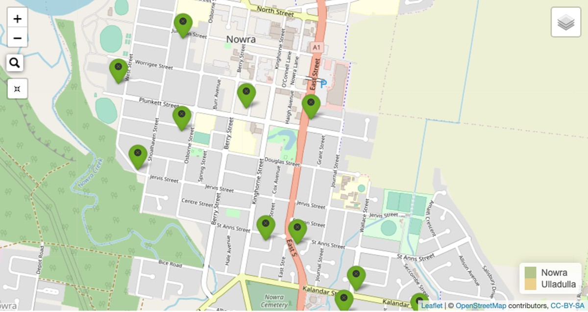
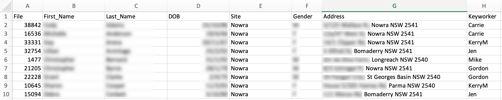
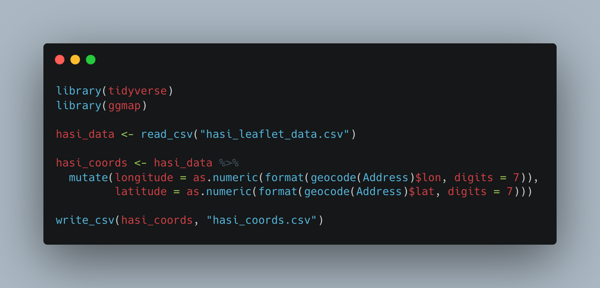
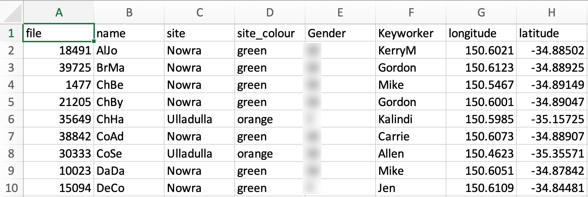

```{r setup, include=FALSE}
knitr::opts_chunk$set(echo = FALSE)
```

```{r map-image}

```


### Relevance to Data Analytics Skills
* Using RMarkdown
* Accessing data from Google Maps API
* Data wrangling
* Using R code
* Creating interactive map with Leaflet
* Providing data in form that provides value to users
* Ability to find resources & help online

---
### To the project...

At a recent interview I had several questions about APIs, so I thought I would do a few projects that involve retrieving data from online applications' databases. API is the acronym for Application Programming Interface, which is a software intermediary that allows two applications to talk to each other.

In this project I set up an account with the [Google Maps Platform]("https://developers.google.com/maps"){target="_blank"} which then allowed me to serve up a list of street addresses and receive back their latitude and longitude coordinates. I needed these in order to place the markers on the leaflet map I was using for the visualisation. I started with an Excel spreadsheet as shown below:

```{r excel-image}

```

I saved that file as a .csv and then brought it into R to perform the following:

```{r r-code}

```

The ggmap::geocode() returns the latitude and longitude for street addresses after accessing the Google Maps Platform API.

I did some more wrangling of the hasi_coords.csv file to produce the following:

```{r csv-image}

```

Now, with the data ready, I proceeded to make the map.

```{r mapping-code, echo=TRUE}
library(tidyverse)
library(leaflet)
library(leaflet.extras)

hasi_coords <- read_csv("hasi_coords_A.csv")

hasi_coords$file <- as.character(hasi_coords$file)

Adam_data <- hasi_coords %>% 
  filter(Keyworker == "Adam")

Allen_data <- hasi_coords %>% 
  filter(Keyworker == "Allen")

Carrie_data <- hasi_coords %>% 
  filter(Keyworker == "Carrie")

Ebony_data <- hasi_coords %>% 
  filter(Keyworker == "Ebony")

Gordon_data <- hasi_coords %>% 
  filter(Keyworker == "Gordon")

Jen_data <- hasi_coords %>% 
  filter(Keyworker == "Jen")

Kalindi_data <- hasi_coords %>% 
  filter(Keyworker == "Kalindi")

KerryM_data <- hasi_coords %>% 
  filter(Keyworker == "KerryM")

Mike_data <- hasi_coords %>% 
  filter(Keyworker == "Mike")

pal <- colorFactor(palette = c("olivedrab", "goldenrod"),
                   levels = c("Nowra", "Ulladulla"))

Adam_icons <- awesomeIcons(
  icon = "ios-close",
  iconColor = "black",
  library = "ion",
  markerColor = Adam_data$site_colour
)

Allen_icons <- awesomeIcons(
  icon = "ios-close",
  iconColor = "black",
  library = "ion",
  markerColor = Allen_data$site_colour
)

Carrie_icons <- awesomeIcons(
  icon = "ios-close",
  iconColor = "black",
  library = "ion",
  markerColor = Carrie_data$site_colour
)

Ebony_icons <- awesomeIcons(
  icon = "ios-close",
  iconColor = "black",
  library = "ion",
  markerColor = Ebony_data$site_colour
)

Gordon_icons <- awesomeIcons(
  icon = "ios-close",
  iconColor = "black",
  library = "ion",
  markerColor = Gordon_data$site_colour
)

Jen_icons <- awesomeIcons(
  icon = "ios-close",
  iconColor = "black",
  library = "ion",
  markerColor = Jen_data$site_colour
)

Kalindi_icons <- awesomeIcons(
  icon = "ios-close",
  iconColor = "black",
  library = "ion",
  markerColor = Kalindi_data$site_colour
)

KerryM_icons <- awesomeIcons(
  icon = "ios-close",
  iconColor = "black",
  library = "ion",
  markerColor = KerryM_data$site_colour
)

Mike_icons <- awesomeIcons(
  icon = "ios-close",
  iconColor = "black",
  library = "ion",
  markerColor = Mike_data$site_colour
)

m1 <- leaflet(width = "100%") %>% 
  addTiles(group = "OSM") %>% 
  addProviderTiles("CartoDB", group = "Carto") %>% 
  addProviderTiles("Esri", group = "Esri") %>% 
  addAwesomeMarkers(data = Adam_data, icon = Adam_icons, label = ~paste0(Keyworker," ",file," ",name), group = "Adam") %>%
  addAwesomeMarkers(data = Allen_data, icon = Allen_icons, label = ~paste0(Keyworker," ",file," ",name), group = "Allen") %>%
  addAwesomeMarkers(data = Carrie_data, icon = Carrie_icons, label = ~paste0(Keyworker," ",file," ",name), group = "Carrie") %>%
  addAwesomeMarkers(data = Ebony_data, icon = Ebony_icons, label = ~paste0(Keyworker," ",file," ",name), group = "Ebony") %>%
  addAwesomeMarkers(data = Gordon_data, icon = Gordon_icons, label = ~paste0(Keyworker," ",file," ",name), group = "Gordon") %>%
  addAwesomeMarkers(data = Jen_data, icon = Jen_icons, label = ~paste0(Keyworker," ",file," ",name), group = "Jen") %>%
  addAwesomeMarkers(data = Kalindi_data, icon = Kalindi_icons, label = ~paste0(Keyworker," ",file," ",name), group = "Kalindi") %>%
  addAwesomeMarkers(data = KerryM_data, icon = KerryM_icons, label = ~paste0(Keyworker," ",file," ",name), group = "KerryM") %>%
  addAwesomeMarkers(data = Mike_data, icon = Mike_icons, label = ~paste0(Keyworker," ",file," ",name), group = "Mike") %>%
  
  addLayersControl(baseGroups = c("OSM", "Carto", "Esri"),
                   overlayGroups = c("Adam","Allen","Carrie","Ebony","Gordon","Jen","Kalindi","KerryM","Mike")) %>% 
  addSearchFeatures(
    targetGroups = c("Adam","Allen","Carrie","Ebony","Gordon","Jen","Kalindi","KerryM","Mike"),
    options = searchFeaturesOptions(zoom = 20)
  ) %>%
  addResetMapButton() %>% 
  addLegend(position = "bottomright",
            pal = pal,
            values = c("Nowra","Ulladulla"))

m1
```

### Wrap-up
This project took a lot of googling and reading stackoverflow posts to get leaflet behaving the way I wanted. It took me a while to work out that separate layers needed to be created for each Keyworker in order to get the overlayGroups control and the Seach function working properly, and I had quite a challenge to get the markers to display different colours according to which site the client belonged to. Also, labels don't behave the same way as popups so there was a lot of mucking around with getting this sorted. I'll list the websites and stackoverflow posts I found helpful below. If you've read this far, I thank you for your time and interest in looking at my blog. :-) Mike

Helpful resources:<br>

- [DataCamp: Interactive Maps with leaflet in R]("https://app.datacamp.com/learn/courses/interactive-maps-with-leaflet-in-r"){target="_blank"}
- [Leaflet]("https://leafletjs.com/"){target="_blank"}
- [Leaflet for R: Markers]("https://rstudio.github.io/leaflet/markers.html"){target="_blank}
- [Leaflet for R: Show/Hide Layers]("https://rstudio.github.io/leaflet/showhide.html"){target="_blank}
- [ColorBrewer 2.0]("https://colorbrewer2.org/#type=qualitative&scheme=Dark2&n=3"){target="_blank"}
- [stackoverflow: Multiple markers on same coordinate]("https://stackoverflow.com/questions/36469379/multiple-markers-on-same-coordinate"){target="_blank"}
- [stackoverflow: Adjust size of leaflet map in rmarkdown html]("https://stackoverflow.com/questions/35134960/adjust-size-of-leaflet-map-in-rmarkdown-html"){target="_blank"}
- [stackoverflow: Change color of leaflet marker]("https://stackoverflow.com/questions/32940617/change-color-of-leaflet-marker"){target="_blank"}
[Finding the R.framework directory on a Mac]("https://discussions.apple.com/thread/8514945"){target="_blank"}