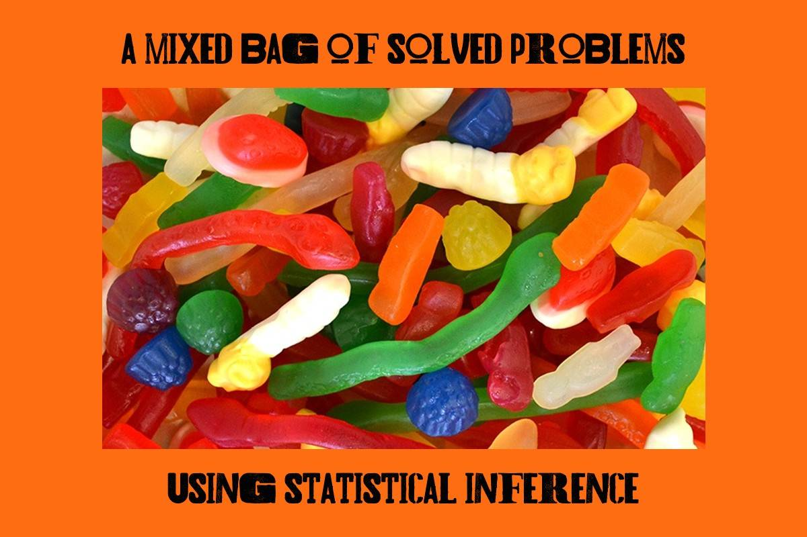

```{r setup, include=FALSE}
knitr::opts_chunk$set(echo = FALSE)
```

```{r map-image}

```

### Relevance to Data Analytics Skills
* Knowledge of statistical inference
* Ability to apply relevant statistical applications to solve problems
* Demonstrated skill in reporting results

---
### To the project...
I wish to show how various problems are solved with R using statistical inference.

**One Sample t-test**
The one sample t-test checks to see if there is a *difference* between one quantitative variable that you collect from your sample, and a *standard* or *recommended value*. A one-sample t-test uses data on a single variable in a sample to compare with a specific hypothesized value, which is usually based on theory, logic, and/or existing research. A two-tailed single-sample t-test assesses whether the sample mean is significantly different from the comparison value specified while a one-tailed test proposes a specific direction for the hypothesized relationship.

Some examples of research questions where you might use the one sample t-test include:

- You are growing tomatoes from seeds. On the back of the seed packet, it says that from the time you plant each seed, it should take 62 days until your first tomato is ready. Out of the 12 seeds you planted, the average time-to-tomato was 65 days. Did it take your plants longer to mature?


*References*

- Gillespie, B.J., Hibbert, K.C., & Wagner III, W.E. 2021 A Guide to R for Social and Behavioral Science Statistics, SAGE.

- Radziwill, N.M. 2019 Statistics (The Easier Way) With R 3ed, Lapis Lucera.
