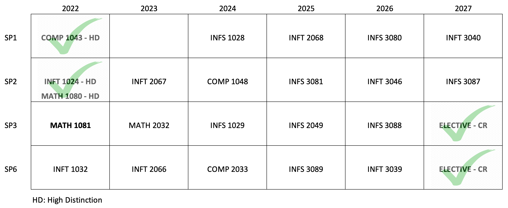

```{r setup, include=FALSE}
knitr::opts_chunk$set(echo = FALSE)
```

```{r map-image}

```

### Relevance to Data Analytics Skills
* Demonstrated pursuit and application of knowledge and skills.

---
### To the project...
I commenced studying data analytics at the beginning of 2022. My results thus far are:

| Subject                                               | Result             |
|-------------------------------------------------------|--------------------|
| COMP 1043 - Problem Solving and Programming           | High Distinction   |
| INFT 1024 - Information Technology Fundamentals       | High Distinction   |
| MATH 1080 - Mathematical Methods for Data Analytics 1 | High Distinction   |
| MATH 1081 - Mathematical Methods for Data Analytics 2 | Not yet released   |
| INFT 1032 - Data Driven Web Technologies              | Currently studying |

