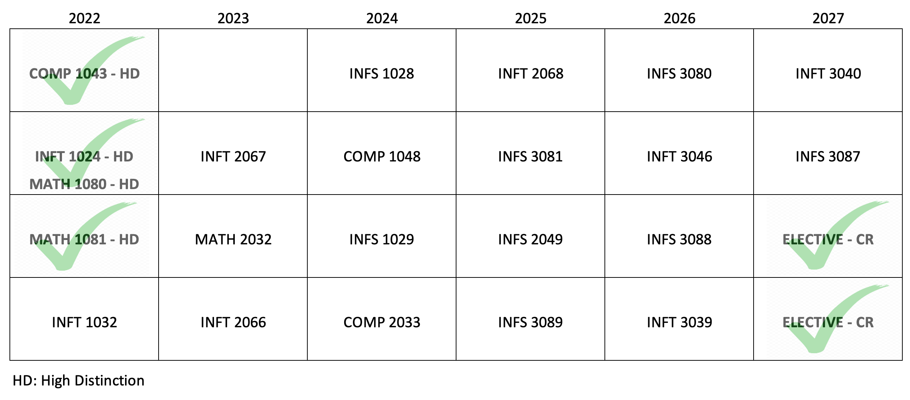

```{r setup, include=FALSE}
knitr::opts_chunk$set(echo = FALSE)
```

```{r map-image}

```

### Relevance to Data Analytics Skills

* Demonstrated pursuit and application of knowledge and skills.

---
### To the project...

I commenced studying data analytics at the beginning of 2022. My results thus far are:

| Subject   |                                           | Result             |
|-----------|-------------------------------------------|--------------------|
| **2022**  |                                           |                    |
| COMP 1043 | Problem Solving and Programming           | High Distinction   |
| INFT 1024 | Information Technology Fundamentals       | High Distinction   |
| MATH 1080 | Mathematical Methods for Data Analytics 1 | High Distinction   |
| MATH 1081 | Mathematical Methods for Data Analytics 2 | High Distinction   |
| INFT 1032 | Data Driven Web Technologies              | Distinction        |
| **2023**  |                                           |                    |
| INFS 1028 | Professional Practice in Data Analytics   | Currently studying |
| INFT 2067 |                                           |                    |
| MATH 2032 |                                           |                    |
| INFT 2066 |                                           |                    |
| **2024**  |                                           |                    |
| INFT 2068 |                                           |                    |
| COMP 1048 |                                           |                    |
| INFS 1029 |                                           |                    |
| COMP 2033 |                                           |                    |
| **2025**  |                                           |                    |
| INFS 3080 |                                           |                    |
| INFS 3081 |                                           |                    |
| INFS 2049 |                                           |                    |
| INFS 3089 |                                           |                    |
| **2026**  |                                           |                    |
| INFT 3040 |                                           |                    |
| INFT 3046 |                                           |                    |
| INFS 3087 |                                           |                    |
| INFS 3088 |                                           |                    |
| INFT 3039 |                                           |                    |

